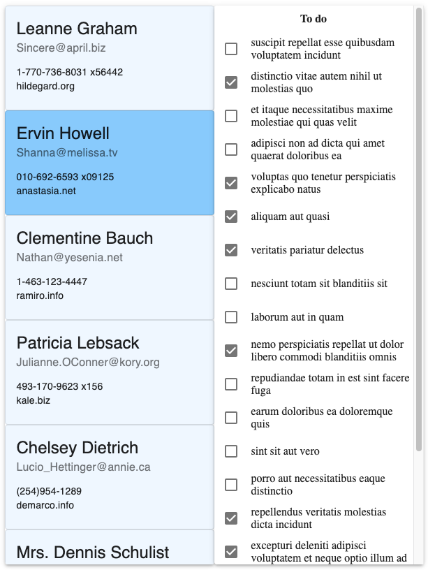

__React-Context template__; an amalgamation of ideas to form a sensible set of conventions for larger scale React projects. Includes example code to guide coding conventions and program structure for new projects.

For React-Redux template see [here]()

## UI
Initial project fetches users and their to-do items from [jsonplaceholder](https://jsonplaceholder.typicode.com)



## Project structure

```
├── api
│   └── remoteApi.ts
├── constants
│   └── Status.ts
├── context
│   ├── TodoContext.tsx
│   ├── UserContext.tsx
│   └── createContextStateProvider.tsx
├── models
│   ├── Dictionary.ts
│   ├── Todo.ts
│   └── User.ts
├── utilities
│   └── callAsync.ts
├── views
│   ├── components
│   │   ├── Header.tsx
│   │   └── ProgressSpinner.tsx
│   ├── users-page
│   │   ├── components
│   │   │   ├── TodoCard.tsx
│   │   │   ├── TodoList.tsx
│   │   │   ├── UserCard.tsx
│   │   │   └── UsersList.tsx
│   │   └── UsersPage.tsx
│   └── App.tsx
└──  index.tsx
```

package.json inclusions:
* TypeScript
* Material-UI
* lodash
* axios
* ...

Work in progress; omissions include, testing (Cypress, React Testing Library, Jest), Storybook, fetched data validation, etc...

### `npm start`

Runs the app in the development mode.<br />
Open [http://localhost:3000](http://localhost:3000) to view it in the browser.


